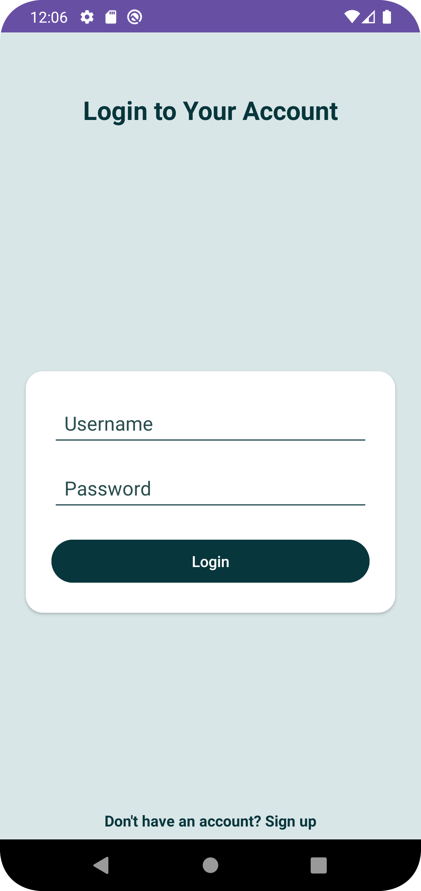

# Expense Tracking App

## Overview
The **Expense Tracking App** allows users to manage their expenses efficiently. It supports user authentication with JWT-based login and signup, expense management, and features such as adding, editing, deleting, and displaying expenses.

The app communicates with a backend API built with **Node.js**, **Express**, and **MongoDB**. The front-end is developed in **Android Studio** using **Java**.

## Features
- **User Authentication:**
  - Sign up for a new account.
  - Login to an existing account.
  - JWT-based authentication for secure access.
  
- **Expense Management:**
  - Add, edit, and delete expenses.
  - View a list of all expenses.
  - Date formatting for easier understanding.
  - Display expenses in a clean and structured UI.

- **Expense Details:**
  - Title, amount, date, and description fields for each expense.
  - Expenses are stored in a database and can be fetched for display.

## Tech Stack
**Frontend:**  
  - Android Studio (Java, XML, Gradle)
	-	Java: Used for the app’s logic and functionality.
	- XML: Used for designing layouts and UI elements.
	-	Gradle: Used for project build configuration and dependency management.
- **Backend:** Node.js, Express, MongoDB
- **Database:** MongoDB Atlas
- **Authentication:** JWT (JSON Web Tokens)
- **API Communication:** Retrofit (for HTTP requests)
- **Logging:** HttpLoggingInterceptor (for network call debugging)

## Getting Started

### Prerequisites

1. **Android Studio:** Make sure you have Android Studio installed for building and running the app.
2. **Node.js and MongoDB:** Set up the backend with Node.js and MongoDB. The backend API is hosted on Render (or can be run locally).
3. **Retrofit Client:** The app uses Retrofit for API calls, so you will need a working Retrofit client setup.

### Clone the Repository

```bash
git clone https://github.com/Rohitk2081/Expense-App
cd expense-tracking-app
```
### Frontend Setup
1. Open the project in Android Studio.
2. Build and run the app on an emulator or device.


### Backend Setup (if running locally)
1. Clone the backend repository.
```bash
git clone https://github.com/Rohitk2081/API
```
2. Install dependencies:
    ```bash
    npm install
    ```
3. Set up MongoDB Atlas or use a local MongoDB instance.
4. Configure the `.env` file for backend settings.
5. Start the server:
    ```bash
    node server.js
    ```
### Backened Testing and utilisation (Using Render/Postman)
```bash
https://api-00hf.onrender.com
```
1. For testing click
  [test](https://api-00hf.onrender.com/test)


## API Endpoints

### Authentication
- **POST auth/login**
  - Request Body:
    ```json
    {
      "email": "user@example.com",
      "password": "your-password"
    }
    ```
  - Response:
    ```json
    {
      "token": "jwt-token",
      "id": "user-id",
      "username": "user-name",
      "email": "user-email"
    }
    ```

- **POST auth/signup**
  - Request Body:
    ```json
    {
      "username": "user-name",
      "email": "user@example.com",
      "password": "your-password"
    }
    ```
  - Response:
    ```json
    {
      "message": "User registered successfully"
    }
    ```

### Expenses
- **GET auth/expenses**
  - Request Headers:
    ```json
    {
      "Authorization": "Bearer token"
    }
    ```
  - Response: List of expenses with fields `title`, `amount`, `date`, `description`, and `expenseId`.
    ```json
    [
      {
        "title": "expense-title",
        "amount": "amount",
        "date": "2024-11-16",
        "description": "expense-description",
        "expenseId": "123456789"
      },
      ...
    ]
    ```

- **POST auth/expenses**
  - Request Body:
    ```json
    {
      "title": "expense-title",
      "amount": "amount",
      "date": "2024-11-16",
      "description": "expense-description"
    }
    ```
  - Response:
    ```json
    {
      "message": "Expense added successfully",
      "expense": { ... }
    }
    ```

- **PUT auth/expenses/{expenseId}**
  - Request Body:
    ```json
    {
      "title": "updated-title",
      "amount": "updated-amount",
      "description": "updated-description"
    }
    ```
  - Response:
    ```json
    {
      "message": "Expense updated successfully"
    }
    ```

- **DELETE auth/expenses/{expenseId}**
  - Response:
    ```json
    {
      "message": "Expense deleted successfully"
    }
    ```

## Folder Structure

```
expense-tracking-app/
│
├── app/                          # Android App code
│   ├── src/                      # Source files for the app
│   │   ├── com/kehgye/           # Main package
│   │   │   ├── expenseadapter/   # Expense Adapter for RecyclerView
│   │   │   ├── LoginActivity.java
│   │   │   ├── SignupActivity.java
│   │   │   ├── MainActivity.java
│   │   │   ├── ApiService.java   # Retrofit API interface
│   │   │   └── ...               # Other app-related files
│   └── build.gradle              # Gradle build file
│
├── backend/                      # Node.js backend code
│   ├── expense.js                # Expense API routes
│   ├── server.js                 # Main backend server file
│   └── ...                       # Other backend-related files
│
├── README.md                     # Project README file
└── .gitignore                    # Git ignore file
```

## Screenshots

Include any relevant screenshots for login, expense listing, and expense management features. 


1. **Splash Screen:**

   

2. **Login Screen:**

   

3. **SignUp Screen:**

   

4. **Expense List:**

   

5. **Add Expense:**

   

## Contributing

1. Fork the repository.
2. Clone your fork.
3. Create a new branch (`git checkout -b feature/your-feature`).
4. Commit your changes (`git commit -m 'Add feature'`).
5. Push to your fork (`git push origin feature/your-feature`).
6. Create a pull request.

<!-- ## License
This project is licensed under the MIT License - see the [LICENSE](LICENSE) file for details. -->

---

## Contact
**Author**: [Rohit](https://github.com/Rohitk2081/)
<!-- **Note:** Make sure to replace placeholders (like `your-username`) with your actual information, and customize this README further if needed. -->
